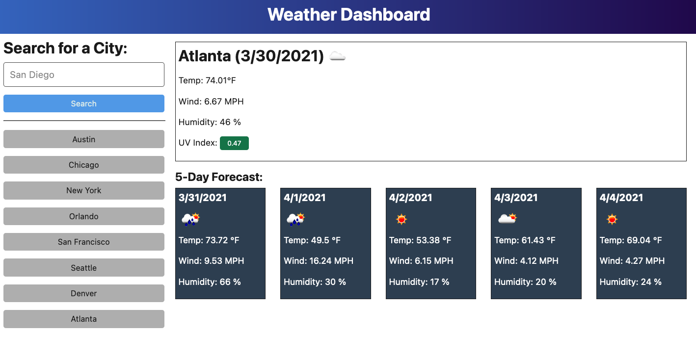

# 06 Server-Side APIs: Weather Dashboard

## Your Task

Make a weather dashboard that tracks weather for searched locations.

## Mock-Up

The following image shows the web application's appearance and functionality:

## Questions

Please send any questions/comments to dmcarver0611@gmail.com! Ill respond as soon as possible :)
